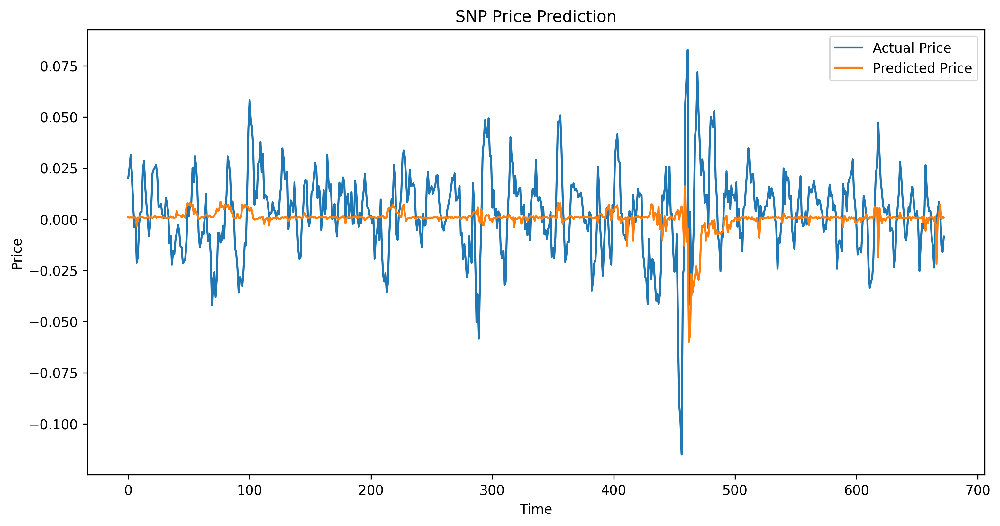
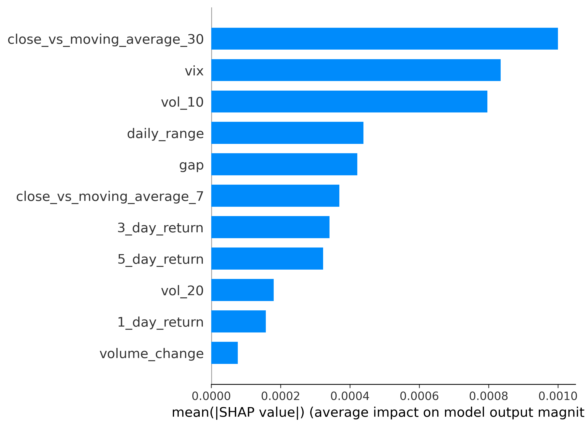
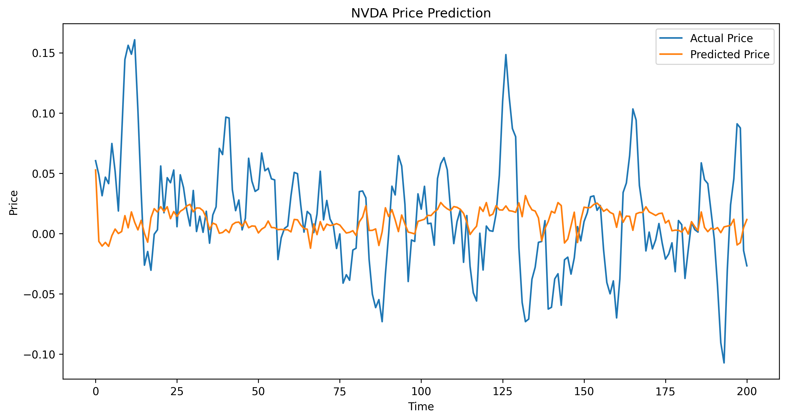
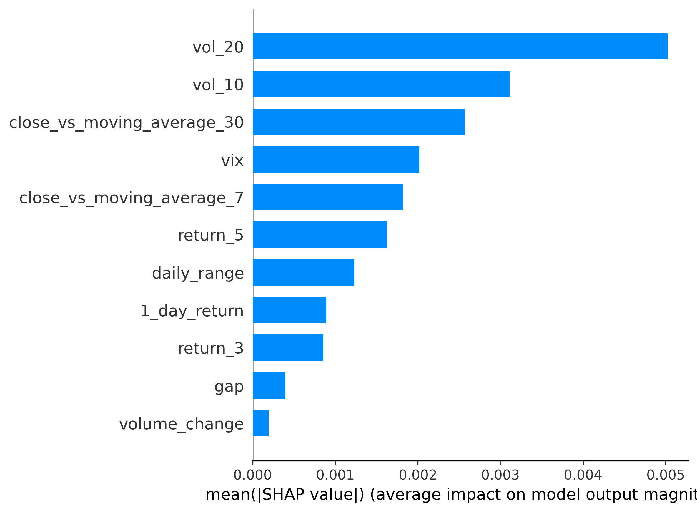
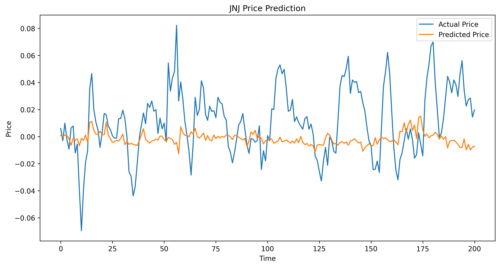
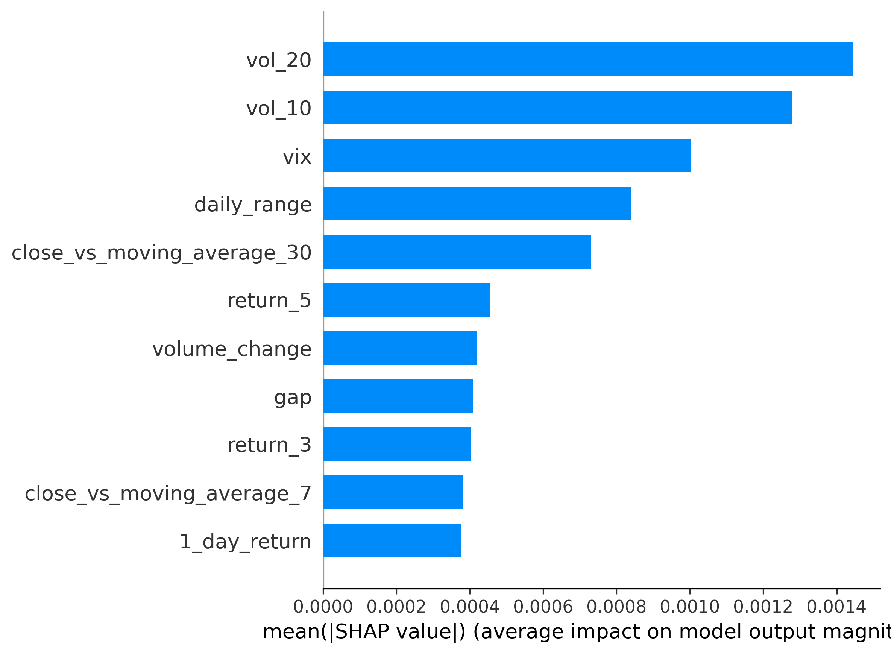
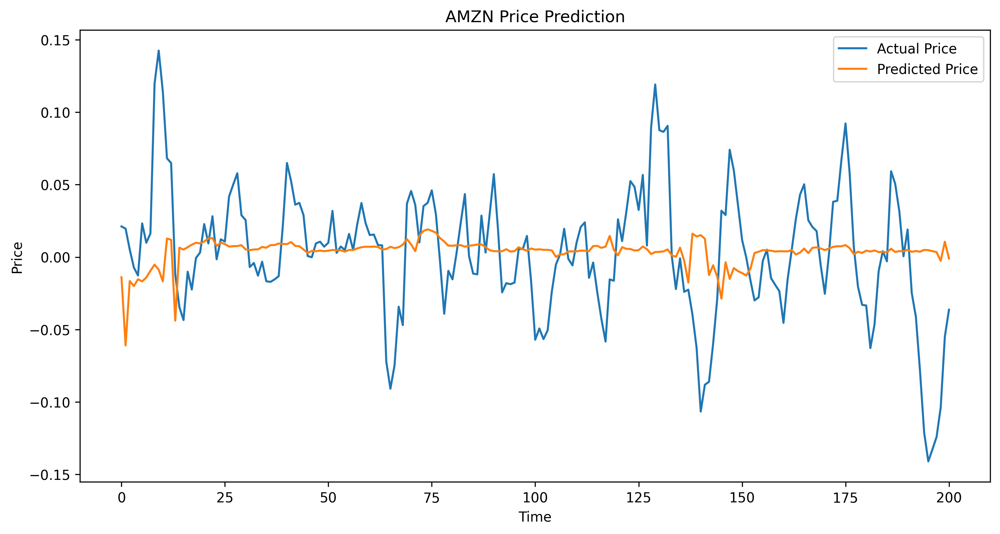
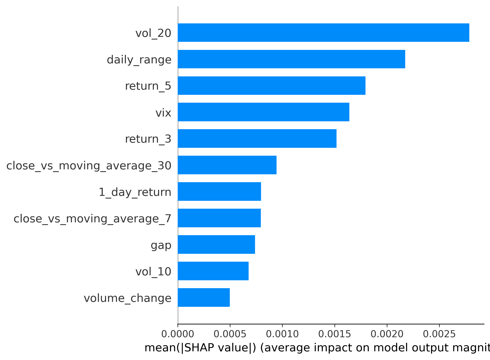

# Short-Term Stock Return Prediction Using Machine Learning
Machine learning project that integrates Alpaca API and the Yahoo Finance package in python to engineer market features and predict 5-day forward returns for four publicly traded stocks.

# Executive Summary

This project asks and answers the question of how well a machine learning model, in our case a Random Forest, predicts 5-day forward short-term returns for the S&P 500 and 3 other individual stocks. It uses the Alpaca API and the Yahoo Finance package to obtain S&P 500 data stretching back to January 1st, 2000. The Alpaca API data is used for the NVIDIA, Johnson & Johnson, and Amazon stocks from January 1st, 2018, until February, 18 2016.

The result of the models show that they have limited predictive power when forecasting 5-day returns. This result is consistent with the market theories and proves that just using historical numerical data is extremely limited.

___

## Dataset Overview

### S&P (500) (SPY)

- Time Period: 2000-2026 
- Observations: 6760 daily obervations
- Variables: 11 predictors
- Target Variable: 5-day forward return

### NVIDA (NVDA)

- Time Period: 2018-2026 
- Observations: 2042 daily obervations
- Variables: 11 predictors
- Target Variable: 5-day forward return

### Johnson & Johnson (JNJ)

- Time Period: 2018-2026 
- Observations: 2042 daily obervations
- Variables: 11 predictors
- Target Variable: 5-day forward return

### Amazon (AMZN)

- Time Period: 2018-2026 
- Observations: 2042 daily obervations
- Variables: 11 predictors
- Target Variable: 5-day forward return

___

## Explanatory Variables

### Total Variables Used in Model: 11

### Momentum Features:

- 1_day_return
- 3_day_return 
- 5_day_return

Captures daily percentage returns over 1-day, 3-day, and 5-days. This is used to capture momentum trends. 

### Intraday Price Behavior:

- daily_range
- gap

Daily range measures difference between the day's high and low and the gap variable measures the day's volatility.

### Trend Indicators:

- moving_average_7
- moving_average_30 
- close_vs_moving_average_7
- close_vs_moving_average_30

Moving_average_7 and Moving_average_30 represent 7-day and 30-day rolling averages, while close_vs_moving_average_7 and close_vs_moving_average_30 indicate short-term trends and any trend reversals over the past 30 days.

### Volume Measures:

- volume_change

Volume_Change variable is the daily percentage change in trading volume.

### Volatility Measures:

- vol_10
- vol_20

These variables are the rolling standard deviations of returns over 10 and 20 days, respectively, capturing short-term and long-term volatility.

### Market Sentiment:

- vix

VIX, also known as the fear index, measures the expected volatility of stocks over the next 30 days. VIX is used here for sentiment analysis, and it is the closest available variable for this project.

### Target Variable:

- target

The target variable is the percentage return over the next 5 days, chosen to reduce noise and maximize accuracy.

---

### Methodology

Training and Testing Data

- Data was split using a time-based split due to the fact that this is a time-series prediction.
- The training set is the first 90% of observations, which was used to fit the model.
- The testing set is set at the last 10% of the observations to evaluate the model. 

Models Used

- A Random Forest regression model was used to predict 5-day forward returns

Evaluation Metrics 

- Mean Absolute Error (MAE) was used to predict the magnitude error 
- R-Squared (R^2) was used to assess the explanatory power.
- Directional Accuracy was used to see how accurately the model can predict the sign of returns.

---

### Results

The Model performeance demonstrated limited explantory power in predicitng 5-day forward returns.

##### S&P 500 Price Prediction Graph

##### S&P 500 SHAP Values

- S&P 500 (SPY):
    - MAE = 0.015, R² = -0.126, Directional Accuracy = 56.6%.

##### NVDA Price Prediction Graph

##### NVDA SHAP Values

- NVIDA (NVDA):
    - MAE = 0.04, R² = -0.04, Directional Accuracy = 64%.

##### JNJ Price Prediction Graph

##### JNJ SHAP Values

- Johnson & Johnson (JNJ):
    - MAE = 0.03, R² = -0.33, Directional Accuracy = 43.8%.

##### AMZN Price Prediction Graph

##### AMZN SHAP Values

- Amazon (AMZN):
    - MAE = 0.03, R² = -0.06, Directional Accuracy = 54.2%.

Across all models and stocks, the R^2s were negative, indicating the difficulty of predicting short-term returns, especially with only historical data.

#### Variable Importance

Among the variables that had the most impact on the models 

- Rolling volatility variables: (vol_20, vol_10)
- VIX
- Daily range 

It shows that volatility significantly affects these stocks when predicting short-term results, as evidenced by the model struggling to predict a safe stock like JNJ but succeeding with a volatile one like NVIDIA. 

___

### Discussion

Some insights from this project are that short-term returns are difficult to predict. It has been made clear in this case that the models struggle to predict five-day returns for any of the stocks. Regarding the Johnson and Johnson stock, flipping a coin would statistically have better directional accuracy than the model. The low R^2 values mean that the models perform worse than predicting the mean and that there is excessive noise in predicting daily and 5-day returns. Also, the model performs worse than just predicting the average every time. Additionally, more volatile stocks seem better suited to the model, since NVIDIA had the highest MAE and an R^2 closer to 0. In contrast, stable/defensive stocks like JNJ and the S&P are harder to predict for short-term returns. Markets are hard to predict on short-term horizons.

This matters because it further shows the limits of Machine Learning, especially in financial markets, and how finance is complex and has many more variables than just numbers. Sentiment Analysis, Order Flow in trading, and macroeconomic policy also play a huge role in the Finance Markets. When it comes to answering the question: how well can machine learning models predict short-term returns in different stocks, the answer is not well. However, with more time and resources, if I were to take this project further, I would implement sentiment analysis covering the same time period as the model. Additionally, I would seek more quantitative data, such as order flow, to improve the model's accuracy. 

